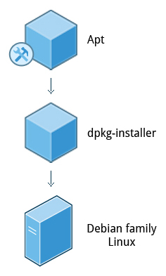

# Chapter 5: System Configuration from the Graphical Interface

**Note**: This chapter is pretty useless for Linux power users.

## Tasks
- [x] None

## gnome-tweaks

A lot of personalized configuration settings do not appear on the settings menus. Instead, you have to launch a tool called either **gnome-tweaks** (or **gnome-tweak-tool** on older Linux distributions).

The most recent GNOME versions have removed a lot of the functionality of **gnome-tweaks**; extensions now have to be configured using a new app called **gnome-extensions-app**.

## Display Settings

If your system uses a proprietary video card driver (usually from **nVidia** or **AMD**), you will probably have a separate configuration program for that driver.

The X server, which actually provides the GUI, uses `/etc/X11/xorg.conf` as its configuration file *if it exists*; In modern Linux distributions, this file is usually present only in unusual circumstances, such as when certain less common graphic drivers are in use. Changing this configuration file directly is usually for more advanced users.

## Network Time Protocol

The **Network Time Protocol** (NTP) is the most popular and reliable protocol for setting the local time by consulting established Internet servers. Linux distributions always come with a working NTP setup, which refers to specific time servers run or relied on by the distribution. This means that no setup, beyond "on" or "off", is generally required for network time synchronization.

## Lab 5.1: Getting and Setting Screen Resolution

**NOTE**: You can also ascertain your current resolution by typing at the command line:

```bash
$ xdpyinfo | grep dim
dimensions: 3200x1080 pixels (847x286 millimeters)
```

## Network Configuration

All Linux distributions have network configuration files, but file formats and locations can differ from one distribution to another. Hand editing of these files can handle quite complicated setups, but is not very dynamic or easy to learn and use. **Network Manager** was developed to make things easier and more uniform across distributions.

## Installing and Updating Software

Each package in a Linux distribution provides one piece of the system, such as the Linux kernel, the C compiler, utilities for manipulating text or configuring the network, or for your favorite web browsers and email clients.

## Debian Packaging

**dpkg** is the underlying package manager for these systems. It can install, remove, and build packages. Unlike higher-level package management systems, it does not automatically download and install packages and satisfy their dependencies.



For Debian-based systems, the higher-level package management system is the **Advanced Package Tool** (APT) system of utilities. Generally, while each distribution within the Debian family uses APT, it creates its own user interface on top of it (for example, apt and apt-get, synaptic, gnome-software, Ubuntu Software Center, etc). Although apt repositories are generally compatible with each other, the software they contain generally is not. Therefore, most repositories target a particular distribution (like Ubuntu), and often software distributors ship with multiple repositories to support multiple distributions. Demonstrations are shown later in this section.

## Red Hat Package Manager (RPM)

Red Hat Package Manager (RPM) is the other package management system popular on Linux distributions. It was developed by Red Hat, and adopted by a number of other distributions, including SUSE/openSUSE, Mageia, CentOS, Oracle Linux, and others.


The higher-level package manager differs between distributions. Red Hat family distributions historically use RHEL/CentOS and Fedora uses dnf, while retaining good backwards compatibility with the older yum program. SUSE family distributions such as openSUSE also use RPM, but use the zypper interface.
