# Linux Foundation Certificates

**NOTE**: A subset of these courses is offered in Japanese and Chinese.

**Areas of Interest**
* Blockchain
* Cloud & Containers
* DevOps & Site Reliability
* System Administration
* Systems Engineering
* Web & Application

## Certificates

### Blockchain

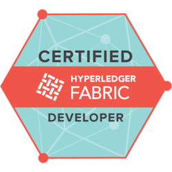

#### [Certified Hyperledger Fabric Developer (CHFD)](https://training.linuxfoundation.org/certification/certified-hyperledger-fabric-developer)
* Description: The Certified Hyperledger Fabric Developer (CHFD) program allows candidates to demonstrate the knowledge to develop and maintain client applications and smart contracts using the latest Fabric programming model.
* Level: Intermediate
* Price: $375

#### [Certified Hyperledger Fabric Administrator (CHFA)](https://training.linuxfoundation.org/certification/certified-hyperledger-fabric-administrator-chfa)
* Description: The Certified Hyperledger Fabric Administrator (CHFA) program allows candidates to demonstrate their competence in deploying and operating a Hyperledger Fabric network through the command line.
* Level: Intermediate
* Price: $375

---

### Cloud & Containers

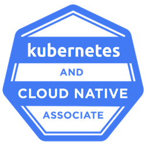

#### [Kubernetes and Cloud Native Associate (KCNA)](https://training.linuxfoundation.org/certification/kubernetes-cloud-native-associate)
* Description: The Kubernetes and Cloud Native Associate (KCNA) exam demonstrates a user's foundational knowledge and skills in Kubernetes and the wider cloud native ecosystem.
* Level: Beginner
* Price: $0

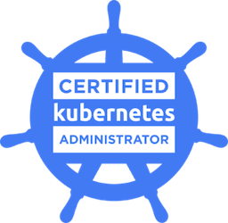

#### [Certified Kubernetes Administrator (CKA)](https://training.linuxfoundation.org/certification/certified-kubernetes-administrator-cka)
* Description: The Certified Kubernetes Administrator (CKA) program provides assurance that CKAs have the skills, knowledge, and competency to perform the responsibilities of Kubernetes administrators.
* Level: Intermediate
* Price: $375

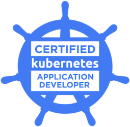

#### [Certified Kubernetes Application Developer (CKAD)](https://training.linuxfoundation.org/certification/certified-kubernetes-application-developer-ckad)
* Description: The Certified Kubernetes Application Developer (CKAD) exam certifies that candidates can design, build and deploy cloud-native applications for Kubernetes.
* Level: Intermediate
* Price: $375

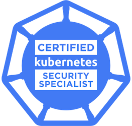

#### [Certified Kubernetes Security Specialist (CKS)]()
* Description: The Certified Kubernetes Security Specialist (CKS) program provides assurance that a CKS has the skills, knowledge, and competence on a broad range of best practices for securing container-based applications and Kubernetes platforms during build, deployment and runtime. CKA certification is required to sit for this exam.
* Level: Intermediate
* Price: $375

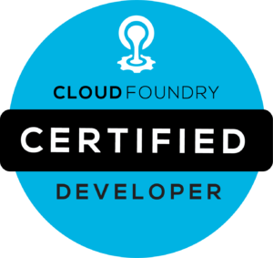

#### [Cloud Foundry Certified Developer (CFCD)](https://training.linuxfoundation.org/certification/cloud-foundry-certified-developer-cfcd)
* Description: The Certified Cloud Foundry Developer exam is ideal for candidates who want to validate their skill set using the Cloud Foundry platform to deploy and manage applications.
* Level: $375
* Price: Intermediate

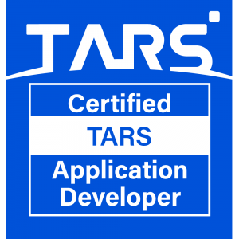

#### [Certified TARS Application Developer (CTAD)](https://training.linuxfoundation.org/certification/linux-foundation-certified-tars-application-developer)
* Description: The Certfied TARS Application Developer (CTAD) exam demonstrates an understanding of critical concepts in microservices and components/functions of the TARS Framework.
* Level: Beginner
* Price: $250

---

### DevOps & Site Reliability

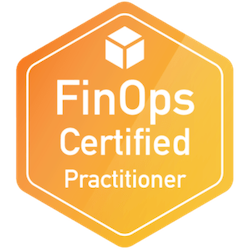

#### [FinOps Certified Practitioner (FOCP)](https://training.linuxfoundation.org/certification/certified-finops)
* Description: FinOps, or "Cloud Financial Operations" is the practice of bringing financial accountability to the variable spend model of cloud, enabling distributed teams to make business trade-offs between speed, cost, and quality.
* Level: Beginner
* Price: $300

---

### System Administration

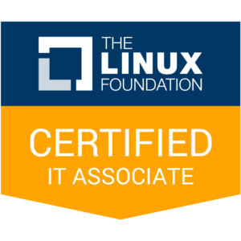

#### [Linux Foundation Certified IT Associate (LFCA)](https://training.linuxfoundation.org/certification/certified-it-associate)
* Description: The Linux Foundation Certified IT Associate (LFCA) exam demonstrates a user's expertise and skills in fundamental information technology functions, especially in cloud computing. It is ideal for those getting started in an IT career as an administrator/engineer.
* Level: $250
* Price: Beginner

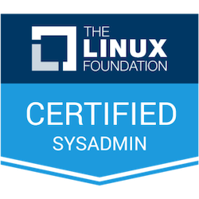

#### [Linux Foundation Certified System Administrator (LFCS)](https://training.linuxfoundation.org/certification/linux-foundation-certified-sysadmin-lfcs)
* Description: The Linux Foundation Certified System Administrator (LFCS) exam is ideal for candidates looking to validate their Linux system administration skill set.
* Level: $375
* Price: Intermediate

---

### System Engineering

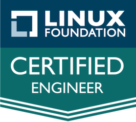

#### [Linux Foundation Certified Engineer (LFCE)](https://training.linuxfoundation.org/certification/linux-foundation-certified-engineer-lfce)
* Description: The Linux Foundation Certified Engineer (LFCE) exam is designed for the Linux engineer looking to demonstrate a more advanced level of Linux administration and engineering skill.
* Level: $375
* Price: Advanced

---

### Web & Application

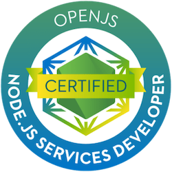

#### [OpenJS Node.js Services Developer (JSNSD)](https://training.linuxfoundation.org/certification/jsnsd)
* Description: The OpenJS Node.js Services Developer (JSNSD) certification tests and verifies candidates' skills in creating RESTful Node.js Servers and Services (or Microservices) with a particular emphasis on security practices.
* Level: Intermediate
* Price: $375

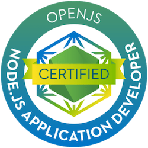

#### [OpenJS Node.js Application Developer (JSNAD)](https://training.linuxfoundation.org/certification/jsnad)
* Description: The OpenJS Node.js Application Developer (JSNAD) certification tests and verifies candidates' skills in using Node.js to create web-based applications.
* Level: Intermediate
* Price: $375
